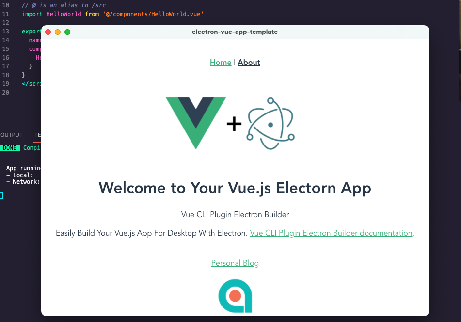

# electron-vue-app-template

## 注意：需要VPN，因为要不然会出现

```
[1/4] 🔍  Resolving packages...
info There appears to be trouble with your network connection. Retrying...
info There appears to be trouble with your network connection. Retrying...
info There appears to be trouble with your network connection. Retrying...
info There appears to be trouble with your network connection. Retrying...
```

## Project setup
```
yarn install
```

### Compiles and hot-reloads for development
```
yarn dev
```

### Compiles and minifies for production
```
yarn build
```

### Lints and fixes files
```
yarn lint
```

## 整合了ElementUI

[https://github.com/share-framework/comline-app](https://github.com/share-framework/comline-app)

感谢element-vue-admin

### Customize configuration
See [Configuration Reference](https://cli.vuejs.org/config/).

## Preview



This project was generated with [vue-cli-plugin-electron-builder](https://github.com/nklayman/vue-cli-plugin-electron-builder) using [vue-cli3](https://cli.vuejs.org/). Documentation about the original structure can be found [here](https://nklayman.github.io/vue-cli-plugin-electron-builder/).
